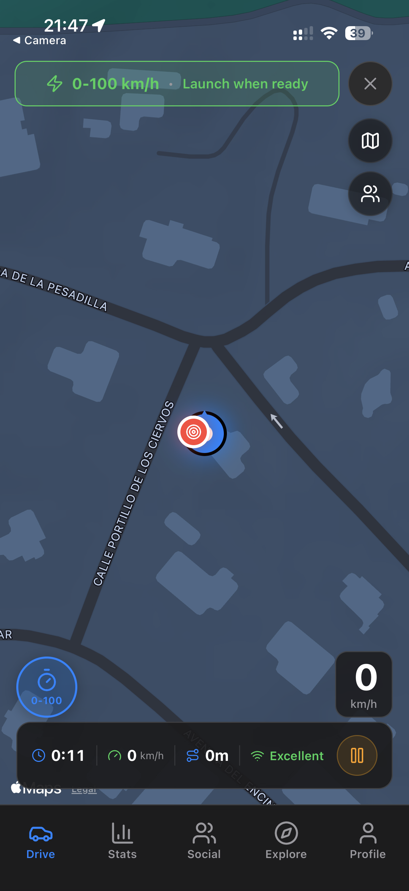
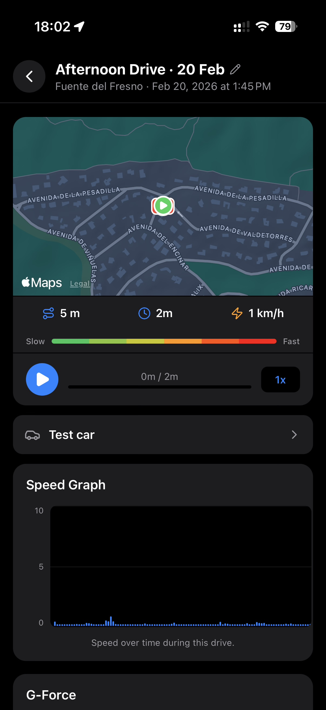
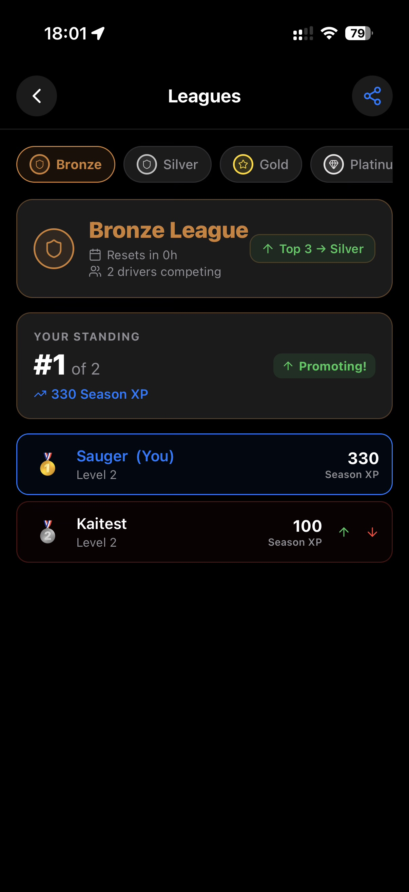
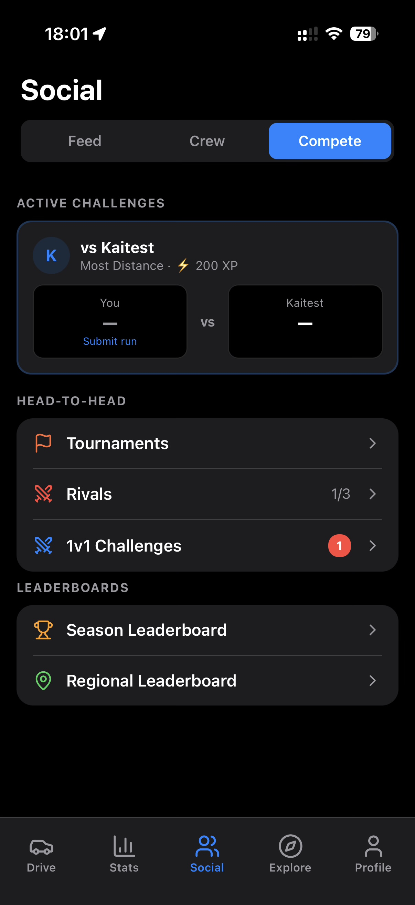
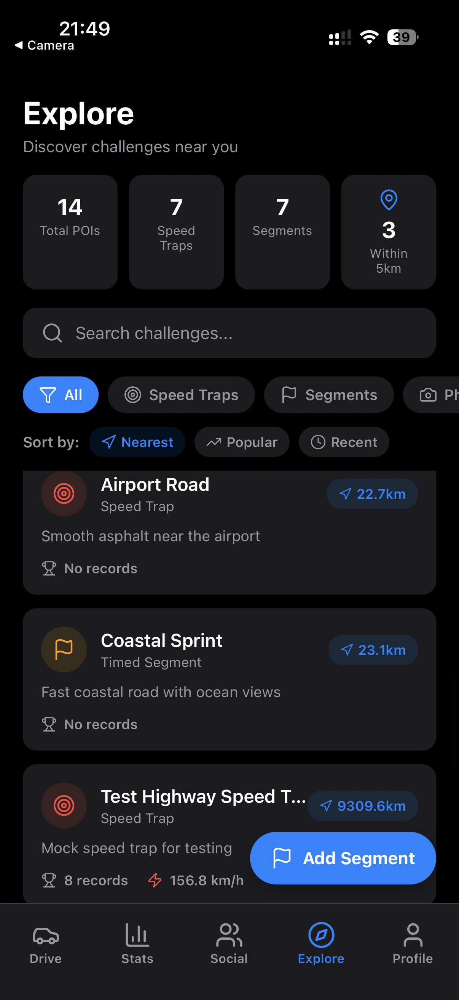

<div align="center">

# Apex

### A social driving app for iOS

*Real-time GPS tracking · Sprint timing · Live convoys · Leaderboards · Gamification*

[](https://apple.com)
[](https://reactnative.dev)
[](https://typescriptlang.org)
[](https://expo.dev)
[](https://supabase.com)

</div>

---

## Screenshots

<p align="center">
  
  &nbsp;
  
  &nbsp;
  
  &nbsp;
  
  &nbsp;
  
</p>

---

## What is Apex?

Apex is an iOS driving companion that turns every drive into a social, competitive event. It started as a GPS speedometer and grew into a platform where drivers can time sprints against their own ghost, run group convoys with live walkie-talkie audio, compete on segment leaderboards, and track their season across a full XP and achievement system.

The app is currently pending App Store submission.

---

## Core Features

### Drive Recording
- OLED speedometer with live speed, heading, altitude, and g-force display
- Background GPS recording — sessions survive app backgrounding
- Automatic drive start/end detection
- Drive history with map replay, speed graph scrubber, tags, and notes
- Reverse-geocoded location names (city / district) per drive
- Privacy mode — suppresses all broadcasts and leaderboard writes for a session

### Sprint Timing
- 0–100 km/h and 100–200 km/h modes
- Accelerometer-assisted launch detection for ±40ms accuracy
- Ghost overlay — renders your personal-best ghost position on the map in real time during a sprint
- Sprint results card auto-generated as an OLED PNG, shareable via native share sheet
- Per-vehicle-class sprint leaderboards

### Social Layer
- **Convoys** — real-time group drives: push-to-talk audio (1.5-second chunks over Supabase Realtime broadcast, no database writes), live member positions on map, and a dashed route line between members
- **Crews** — persistent groups with XP contribution tracking and a global crew leaderboard
- **Crew Wars** — 4-crew league brackets, 3-day windows, per-capita scoring to keep small crews competitive
- **Versus** — 8-stat head-to-head comparison against any friend or the global average driver
- **1v1 Challenges** — async sprint challenges with accept/decline flow and push notifications
- **Tournaments** — bracket-style sprint competitions
- **Rivals** — auto-assigned based on similar stats; tracked head-to-head record over time
- Social feed: drive posts, segment records, achievements, level-ups, and manual posts

### Community POI System
- **Speed traps** — crowdsourced locations with 300m advance TTS warning and per-trap leaderboards
- **Timed segments** — start/end gate detection, optional checkpoint validation, ghost comparison, per-segment leaderboards
- **Photo spots** — community-tagged scenic locations on the map
- **Community routes** — shareable drive paths with metadata
- In-app segment creator: 5-step modal flow with live gate placement on a mini map
- POI ratings, proximity filtering that scales radius by current speed

### Gamification
- XP and levelling (100 levels) with TTS level-up announcements
- 108 achievements across 6 categories, persisted per profile
- Daily and weekly challenges with live progress bars and countdown timers to reset
- Season leagues with regional and global leaderboards
- Drive streaks with a push notification reminder at 8pm if not yet driven
- Goals system — distance, top speed, sprint count targets
- Recap — weekly / monthly / yearly stats with a shareable highlight card

### Safety
- Crash detection — 10Hz accelerometer, gravity-filtered; ≥3g sustained ≥200ms triggers an alert with "I'm fine" / "Call Emergency (112)" options and a 60-second cooldown

### Profile & Settings
- Avatar upload (photo picker → Supabase Storage)
- Vehicle garage — add cars with make, model, year, and power; track per-vehicle stats
- Vehicle comparison — 6-stat side-by-side table
- Referral system with shareable invite links
- Stats percentile badges vs global userbase (top speed, distance, sprints, segments)
- Sign in with Apple
- Battery saver mode — reduces GPS to 0.33Hz + Balanced accuracy
- Temporary location sharing — 1h / 2h / 4h timer with countdown badge
- Offline queue — drives, sprints, XP, and achievements queue locally and drain automatically on reconnect
- GDPR data export — full JSON bundle of all user data, shared via native share sheet
- Account deletion — cascades all user data across the database

---

## Architecture

The app is ~44,000 lines of TypeScript across 186 source files. It uses Expo's managed workflow with Expo Router for file-based navigation and 17 React Context providers for state.

```
app/                      Expo Router screens (32 screens)
  _layout.tsx             Root: provider stack, ErrorBoundary, AuthGate
  (tabs)/                 Tab navigator (Drive · Stats · Social · Explore · Profile)
src/
  components/             59 reusable UI components
  context/                17 React Context providers
  hooks/                  GPS, sprint timer, live tracking, deep links
  services/               Supabase, AudioQueue, SegmentDetection, PTT, crash detection, ...
  theme/                  OLED colour palette + 6 Mapbox map styles
supabase/functions/       Edge Functions (push notification delivery)
```

**Provider stack order matters** — each provider can only consume providers above it:

```
ThemeProvider → AuthProvider → MapThemeProvider → POIProvider →
FriendsProvider → ConvoyProvider → CrewProvider → AudioProvider →
XPProvider → DailyChallengesProvider → VehicleProvider →
AchievementsProvider → ChallengeProvider → TournamentProvider →
RivalProvider → GoalsProvider → NetworkProvider
```

---

## Design Decisions

**React Context over Redux / Zustand**
The app's data divides cleanly into isolated domains (auth, vehicles, social, gamification, audio). Context providers map directly to those domains with no cross-slice selectors needed. Adding Redux for a solo-built app would have been abstraction for its own sake — 17 focused providers each under ~400 lines keeps the mental model flat.

**Supabase Realtime for PTT instead of a WebSocket server**
Push-to-talk audio is base64-encoded in 1.5-second chunks and broadcast over Supabase Realtime's channel system — no database writes, no message history, just ephemeral peer-to-peer audio. This gave sub-300ms delivery without spinning up a dedicated media server. The same Realtime channel carries live friend locations and typing indicators.

**Sprint timing accuracy**
`Date.now()` has ~4ms resolution on iOS. The sprint timer uses `performance.now()` + `requestAnimationFrame` for sub-millisecond precision. Launch detection is accelerometer-based (20Hz polling) rather than GPS-based, which reduces reaction-time variance from ±200ms (GPS lag) to ±40ms. During an active sprint, GPS is polled at 5Hz and spikes (>50 km/h delta between samples) are rejected and filled by accelerometer integration.

**Audio priority queue**
TTS announcements queue through a priority system (`SYSTEM > SEGMENT_RESULT > SEGMENT_APPROACH > FRIEND_NEARBY > LOW`). Without this, a friend-nearby ping would interrupt a segment result call or — worse — a safety alert. Each priority level pre-empts lower ones; same-priority announcements queue FIFO.

**Offline-first drive saves**
GPS coverage is unreliable in car parks, tunnels, and dense urban canyons. Every drive-end, sprint save, XP grant, and achievement unlock writes to a local queue first. If the Supabase call fails, the item stays queued and the `NetworkProvider` drains the queue automatically on reconnect. Users never lose a drive because of a blip in connectivity.

**Mapbox over react-native-maps for the main drive view**
Mapbox's vector tile renderer supports fully custom OLED dark themes at the tile level, not just a colour overlay. The drive screen uses a pure-black tile theme that matches the app's `#000000` background exactly — no halo artefact around map edges. react-native-maps (Google Maps) is used only for the gate-placement mini-map in the segment creator where satellite imagery is more useful than style.

---

## Tech Stack

| Layer | Choice | Why |
|-------|--------|-----|
| Framework | React Native 0.81 + Expo 54 | Managed workflow, OTA updates, Expo Router |
| Language | TypeScript 5.9 strict | Catches entire class of runtime bugs at compile time |
| Navigation | Expo Router 6 | File-based, deep links, typed routes |
| State | React Context (17 providers) | Domain-isolated, no boilerplate overhead |
| Backend | Supabase | Postgres + Realtime + Auth + Storage in one |
| Maps | Mapbox + react-native-maps | OLED tile themes (Mapbox) + satellite imagery (GMaps) |
| GPS | expo-location + expo-task-manager | Foreground + background tracking |
| Audio | expo-av + expo-speech + custom AudioQueue | PTT playback + TTS with priority queuing |
| Animations | react-native-reanimated 4 | 60fps UI without JS thread blocking |
| Notifications | Expo Push + Supabase Edge Function | Server-triggered pushes via database webhook |

---

## Project Scale

| | |
|--|--|
| Lines of code | ~44,000 |
| Source files | 186 |
| Screens | 32 |
| Components | 59 |
| Context providers | 17 |
| Services | 35+ |
| Database tables | 38 |
| Achievements | 108 |
| Target devices | iPhone 12 mini → iPhone 17 Pro Max |

---

## Get the App

> Coming to the App Store. Link will appear here on launch.

---

## License

Copyright © 2026 Kaike Kempe. All rights reserved.
Source code is proprietary — see [LICENSE](LICENSE).
